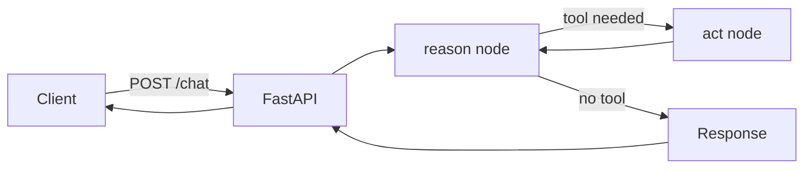

# Pramanix Agent 🤖

[](LICENSE)


An AI agent skeleton built with **LangGraph**, **FastAPI** and **Pydantic**.
A reasoning node decides whether a tool is needed, a tool node runs it, and the
result is returned through a REST API.

> The agent currently uses a keyword-based router and a simulated tool. It is a
> starting point for plugging in a real LLM and real tools.

## Features

- **LangGraph state machine:** reason, act, reason loop for multi-step tool execution.
- **FastAPI endpoints:** `/chat` and `/health`, with automatic OpenAPI docs at `/docs`.
- **Pydantic models:** validated requests and responses.
- **CI:** ruff (lint and format), mypy (strict) and pytest on every push.
- **Docker support.**

## Architecture



1. The client sends a message to `/chat`.
2. The `reason` node inspects the user's message and picks a tool or none.
3. If a tool is chosen, the `act` node runs it and adds the result to the conversation.
4. The graph returns to `reason`, which stops because the last message is not from the user.

## Project structure

```
app/
  agent.py      LangGraph agent (state, nodes, graph)
  main.py       FastAPI server
tests/          pytest suite
examples/       sample client script
```

## Getting started

Requires Python 3.11+.

```bash
git clone https://github.com/manthankro/pramanix.git
cd pramanix
python -m venv .venv && source .venv/bin/activate
pip install -e ".[dev]"
```

### Run the server

```bash
uvicorn app.main:app --reload
```

Open http://localhost:8000/docs for the interactive API docs.

### Docker

```bash
docker build -t pramanix .
docker run -p 8000:8000 pramanix
```

## API

### `POST /chat`

```bash
curl -X POST http://localhost:8000/chat \
  -H "Content-Type: application/json" \
  -d '{"message": "search github for pramanix"}'
```

```json
{
  "response": "[Tool Result]: Successfully fetched repository details from GitHub.",
  "tool_used": "github_search"
}
```

A message without a tool trigger returns `"tool_used": null`.

### `GET /health`

Returns `{"status": "ok"}`.

## Tools

| Tool | Purpose |
|------|---------|
| `github_search` | Simulated GitHub repository lookup, triggered when the message mentions "github" |

## Development

```bash
ruff check .          # lint
ruff format --check . # format check
mypy app/             # type check
pytest                # tests
```

## Roadmap

- Replace the keyword router with an LLM-based decision step.
- Implement real tools (GitHub API, vector search with ChromaDB).
- Add streaming responses.

## License

MIT, see [LICENSE](LICENSE).
