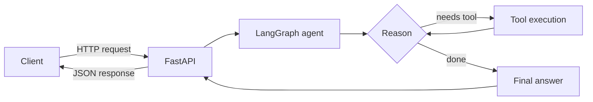

# Pramanix Agent 🤖

[](https://github.com/manthankro/pramanix/actions)
[](LICENSE)


An autonomous AI agent built with **LangGraph**, **FastAPI** and **Pydantic**.
It reasons over a task, decides which tools to call, observes the results and
repeats until it can give a final answer, all exposed through a REST API.

> Update the badge's workflow file name (`ci.yml`) to match the file in `.github/workflows/`.

## Features

- **LangGraph state machine:** a reasoning loop for multi-step tool execution.
- **FastAPI endpoints:** production-ready API with automatic OpenAPI docs.
- **Pydantic models:** validated requests, responses and agent state.
- **Automated CI:** formatting, linting (ruff), type checking (mypy) and tests (pytest).
- **Docker support:** build and run with one command.

## Architecture



1. The client sends a message to the API.
2. The agent node asks the LLM what to do next.
3. If a tool is needed, the tool node runs it and feeds the result back.
4. The loop ends when the LLM returns a final answer (or the step limit is hit).

## Project structure

```
app/            FastAPI app, agent graph and tools
tests/          pytest test suite
examples/       sample client scripts
.github/        CI workflows
.devcontainer/  dev container config
```

## Getting started

### Prerequisites

- Python 3.11+
- An API key for your LLM provider

### Local setup

```bash
git clone https://github.com/manthankro/pramanix.git
cd pramanix
python -m venv .venv && source .venv/bin/activate
pip install -e ".[dev]"
cp .env.example .env   # then edit .env with your keys
```

### Run the server

```bash
uvicorn app.main:app --reload
```

Open http://localhost:8000/docs for the interactive API docs.

### Docker

```bash
docker build -t pramanix .
docker run --env-file .env -p 8000:8000 pramanix
# or
docker compose up --build
```

## Configuration

| Variable | Description | Default |
|----------|-------------|---------|
| `OPENAI_API_KEY` | LLM provider API key | required |
| `MODEL_NAME` | Model used by the agent | `gpt-4o-mini` |
| `HOST` / `PORT` | Server bind address | `0.0.0.0` / `8000` |
| `LOG_LEVEL` | Logging verbosity | `info` |
| `MAX_STEPS` | Max reasoning loop iterations | `10` |

> Edit this table to match the settings your code actually reads.

## Usage example

```bash
curl -X POST http://localhost:8000/chat \
  -H "Content-Type: application/json" \
  -d '{"message": "What is 25 * 4?"}'
```

```json
{ "response": "25 * 4 = 100" }
```

> Adjust the route and payload to match your endpoints. A client script is in `examples/query_agent.py`.

## Tools

| Tool | Purpose |
|------|---------|
| _tool_name_ | _what it does_ |

> List the tools registered in your agent here.

## Development

```bash
ruff check .      # lint
ruff format .     # format
mypy app/         # type check
pytest            # tests
```

## Contributing

Issues and pull requests are welcome. Please run the checks above before opening a PR.

## License

MIT, see [LICENSE](LICENSE).
